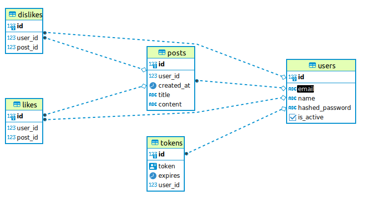

# Webtronic_tasks

Webtronic_tasks - backend-сервис на основе `FastAPI`, предлагающий пользователям возможноcть созавать, редактировать и удалять свои посты. Также пользователи сервиса могут искать чужие посты и ставить им лайки/дизлайки. Авторизация - `JWT`. База данных - `PostgreSQL`. Миграции - `Alembic`. ORM - `SQLAlchemy`. Валидация - `Pydantic`. Зависимости - `Poetry`.   

## Описание схемы БД

База данных содержит 6 моделей: `Пользователь`, `Токен`, `Пост`, `Лайк`, `Дизлайк`. Ниже представлена графическая схема моделей и их взаимосвязей.



## Краткая документация API

Работа с моделями БД осуществляется по следующим эндпоинтам: 

Method | HTTP request                  | Description
------------- |-------------------------------| -------------
[**create_new_user**] | **POST** /sign-up             | Регистрация нового пользователя
[**get_user_by_email**] | **POST** /login               |  Авторизация пользователя.
[**create_post**] | **POST** /posts               | Добавление нового поста.
[**read_post_by_id**] | **GET** /posts/{post_id}      | Извлечение поста по `ID`.
[**update_post_by_id**] | **PUT** /posts/{post_id}      | Редактирование поста пользователя по `ID`.
[**delete_post_by_id**] | **DELETE** /posts/{post_id}   | Удаление поста пользователя по `ID`.
[**read_posts**] | **GET** /posts/               | Извлечение списка всех постов.
[**add_post_like**] | **POST** /like/{post_id}      | Добавление лайка к посту.
[**remove_post_like**] | **DELETE** /like/{post_id}    | Удаление лайка к посту.
[**add_post_dislike**] | **POST** /dislike/{post_id}   | Добавление дизлайка к посту.
[**remove_post_dislike**] | **DELETE** /dislike/{post_id} | Удаление дизлайка к посту.

Исчерпывающую информацию по работе API можно получить после запуска по адресу http://127.0.0.1:8000/
Документация на основе Swagger, в соответствии со стандартом OpenAPI.

## Инструкция по установке

### 1. Подготовка базы данных

1.1 Обновляете систему, уставливаете и запускаете Postgres
```sh
sudo apt update
sudo apt install postgresql-14
```

1.2 Заходите в аккаунт Postgres, открываете терминал Postgres, уставливаете и запускаете Postgres
```sh
sudo -i -u postgres 

psql
```
1.3 Создаете базу данных, подключаетесь и устанавливаете расширение для полнотекстового поиска (pg_trgm)
```sh
CREATE DATABASE <DB_NAME>;
```

### 2. Запуск проекта

2.1 Клонируете репозиторий
```sh
git clone https://github.com/XanderMoroz/recepies_restapi.git
```
2.2 Устанавливаете, виртуальное окружение:
```sh
poetry shell
```
2.3 Устанавливаете зависимости проекта:
```sh
poetry install
```
2.4 Создаете файл `.env` и заполняете его по примеру файла `.env.template`

2.5 Применяете миграции в базе данных
```sh
alembic upgrade head
```
2.6 Запускаете проект:
```sh
uvicorn app.main:app --reload
```
2.7 Документация доступна по адресу: 
```sh
http://127.0.0.1:8000/
```